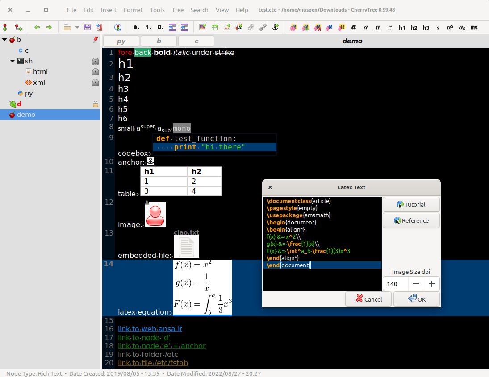

# OrangeArk 橙子笔记

**OrangeArk（橙子笔记）** 是一款层级笔记工具，拥有富文本编辑、代码语法高亮、LaTeX 公式渲染等丰富功能，文档可保存为单一文件或多个文件与目录，默认使用 `.md` 扩展名。

## 核心功能 Features
- **富文本**：前景色、背景色、粗体、斜体、下划线、删除线、小型文字、h1-h6 标题、下标、上标、等宽字体
- **语法高亮**：支持数十种编程语言
- **图片**：插入文本、**鼠标拖拽右下角即可调整大小**、编辑、另存为 PNG
- **QQ 式截图**：一键区域截图（快捷键 Shift+Alt+X），选区后自动复制到剪贴板并插入笔记
- **LaTeX 数学公式**渲染
- **表格**：简单表格与富文本表格，支持**鼠标拖拽整体缩放**，行复制/剪切/粘贴，CSV 导入导出
- **代码框**：富文本中的代码块（可选语法高亮），支持 **Tab / Shift+Tab 缩进与反缩进**、**鼠标拖拽调整宽高**，代码导入导出
- **代码执行**：代码节点和代码框可直接运行，终端与命令可在首选项中配置
- **对齐**：文本、图片、表格、代码框均支持左/中/右/两端对齐
- **超链接**：文本与图片超链接（网页、节点/锚点、文件、文件夹）
- **拼写检查**（基于 gspell）
- **应用内复制/粘贴**：图片、代码框、表格以及富文本混合内容
- **跨应用复制/粘贴**：与 LibreOffice、Gmail 等互通
- 从文件管理器复制文件列表粘贴即生成链接，图片文件自动插入
- **打印与 PDF 导出**：选区/节点/子节点/整棵树
- **HTML / 纯文本导出**：选区/节点/子节点/整棵树
- **多层列表**：无序、有序、待办列表互相切换，支持多行
- **内嵌文件**：插入文本、另存到磁盘
- 节点搜索、全树搜索、命令面板等高效导航

## 保存格式
文档默认以 `.md` 扩展名保存（内部为层级结构化文档格式）。同时兼容打开多种旧版文档格式。

## 下载
前往 [Releases](https://github.com/) 页面下载 Windows 安装版（setup.exe）与便携版（portable.7z）。

## 许可
本项目基于 GNU GPL-3.0 许可证发布，详见 [license.txt](license.txt)。

## 版权
Copyright (C) 2026 OrangeArk contributors
